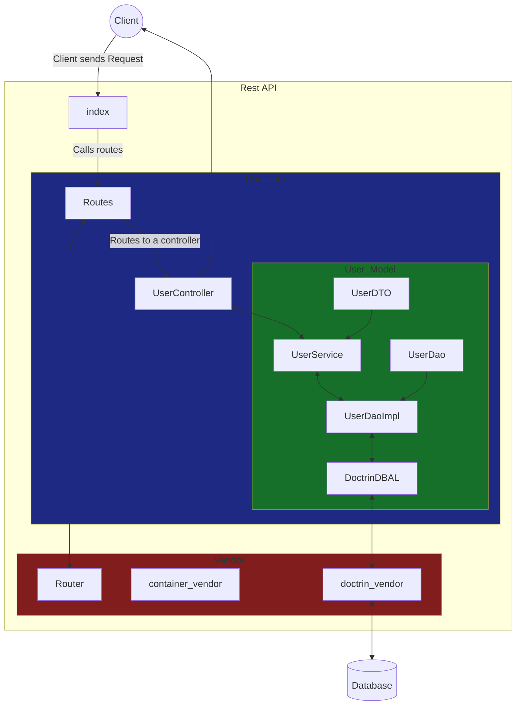

# VirtualHealth - Sr. Software Engineer Assessment

## Running the app
#### Requered
* Composer
* Docker (MySQL)
* PHP 8

To start running the app download the composer packeges in the composer.json dir.
```
composer install
```

Build the Docker Mysql container.
```
docker-compose -f mysql.yml up
```
Using a database client import the db.sql file.


Run the PHP app.
```
php -S localhost:port
```

That's it! 
Now you can start making requests to the Rest API.
```
http://localhost:port/prescribed/$N
```


## App Structure
The app's structure is based on the DAO & DTO design patter and uses a DI Container. 
A simple routing library is being used to simplify requests and Doctrin is being used as a **D**ata**B**ase **A**bstraction **L**ayer.


---  
Class Structure
---

	
## Changes to the Database

Most of the the changes to the database focused on increasing the speed of the query below 
since this is the main query used by the REST API.  All other changes where done considering normalization.
```
SELECT DISTINCT patient.MEDREC_ID, CONCAT(FIRSTNAME, ' ', LASTNAME) AS NAME 
	FROM patient, medication 
	WHERE patient.MEDREC_ID = medication.MEDREC_ID 
	AND medication.PRESCRIBED_COUNT > 1;
```
The biggest improvement I made was adding PRESCRIBED_COUNT column to the medication table.
It describes the number of time a medication has been prescribed and removed duplicates from the medication table. This change increased the query by 6X.

I made MEDREC_ID the primary key for patients and indexed it on allother tables to speed up JOINs 
between tables. Adding these indexes does increase the size of the database. Testing should done to 
see if it's worth the trade off.


#### Patients Table
   * MEDREC_ID convert to INT datata type
   * Make MEDREC_ID the Primary Key
   * PATIENT_NAME should be split into first and lastname
        - FIRSTNAME
        - LASTNAME


#### Medications Table
* MEDREC_ID convert to INT datata type
* index MEDREC_ID column
* Index NDC column
* Add PRESCRIBED_COUNT column and populate with number of duplicates. 
	- Remove duplicate rows.
##### Queries to properly add PRESCRIBED_COUNT:

```
ALTER TABLE medication ADD COLUMN PRESCRIBED_COUNT INT DEFAULT 0;
```
```
UPDATE medication b, 
	(
		SELECT MEDREC_ID, NDC, COUNT(*) AS COUNT 
		FROM medication GROUP BY MEDREC_ID, NDC
	) a
	SET PRESCRIBED_COUNT = a.COUNT 
	WHERE b.MEDREC_ID = a.MEDREC_ID AND b.NDC = a.NDC;
```
```
DELETE n1 
	FROM medication n1
	INNER JOIN
		(
			SELECT MIN(id) id, MEDREC_ID, NDC
	        FROM medication
	        GROUP BY MEDREC_ID, NDC
	        HAVING COUNT(*) > 1
	     ) n2
	ON n1.id > n2.id
	AND n1.MEDREC_ID = n2.MEDREC_ID
	AND n1.NDC = n2.NDC;
``` 


#### Diseas Table
  * Convert MEDREC_ID  to INT datat ype
  * Index MEDREC_ID

