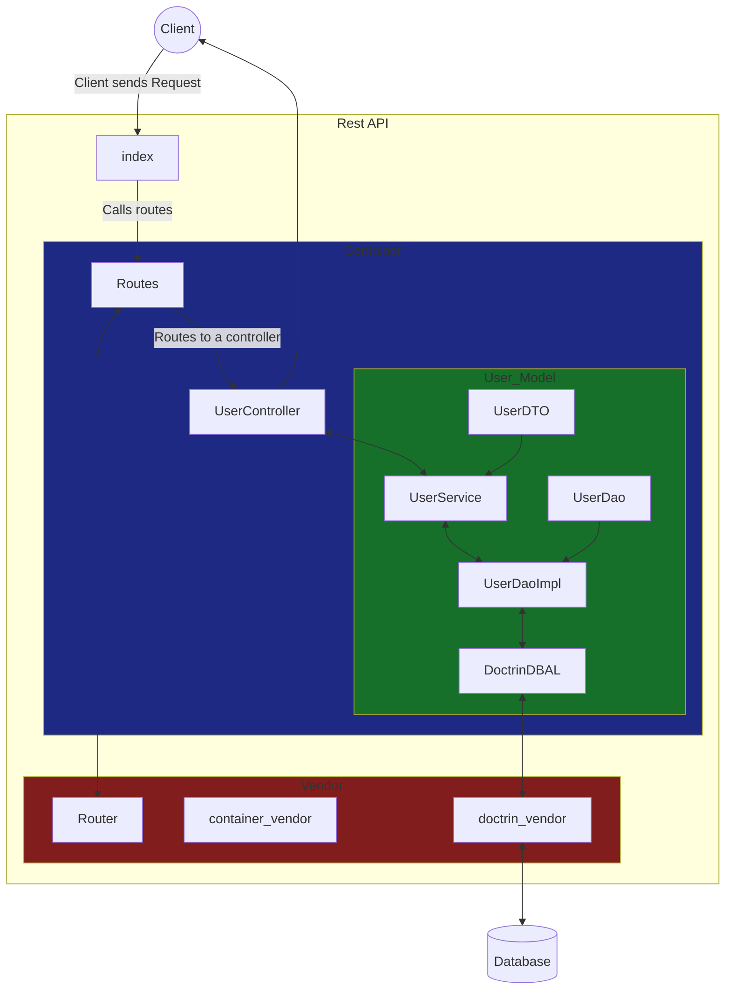

# VirtualHealth - Sr. Software Engineer Assessment

## Running the app
#### Requered
* Composer
* Docker (MySQL)
* PHP 8

To start running the app download the composer packeges in the composer.json dir.
```
composer install
```

Build the Docker Mysql container.
```
docker-compose -f mysql.yml up
```
Using a database client import the db.sql file.


Run the PHP app.
```
php -S localhost:port
```

That's it! 
Now you can start making requests to the Rest API.
```
http://localhost:port/prescribed/$N
```


## App Structure
The app's structure is based on the DAO & DTO design patter and uses a DI Container. 
A simple routing library is being used to simplify requests and Doctrin is being used as a **D**ata**B**ase **A**bstraction **L**ayer.


---  
Class Structure
---
